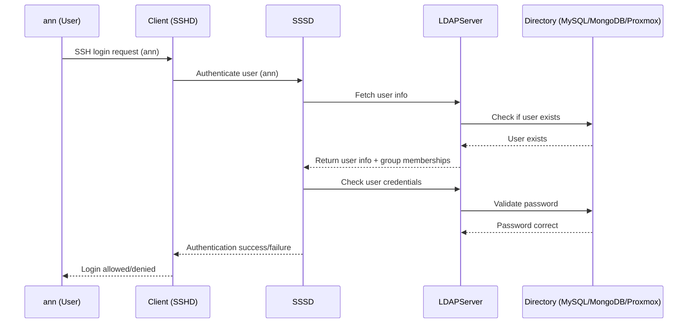
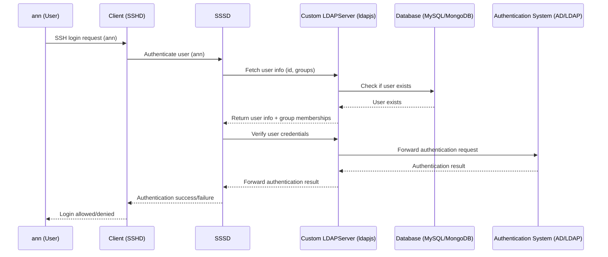
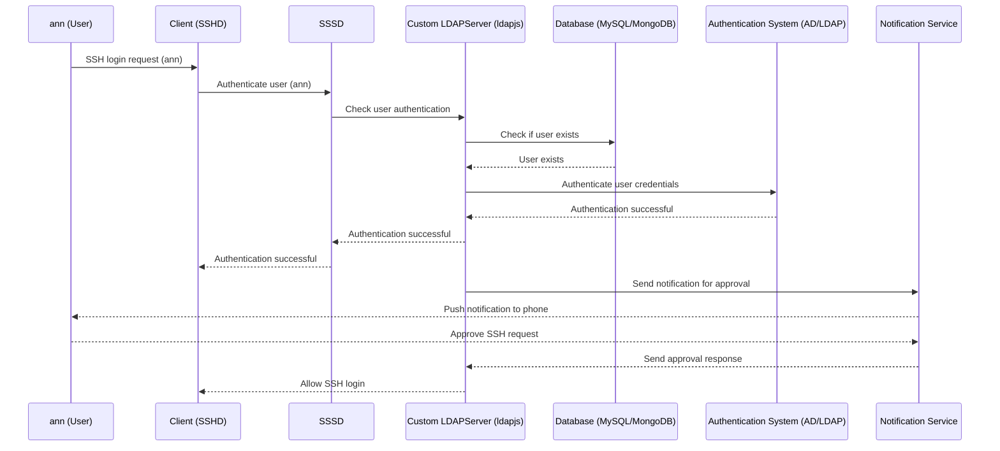

# LDAPServer

This project implements an LDAP gateway server using ldapjs that integrates with multiple backends to manage and authenticate users. It is designed for applications that require LDAP authentication but store user information in other systems, making it compatible with both modern and legacy environments.

## 🖼️ Architecture Overview



---

## ⚙️ Technologies Used

- **Node.js**: The main runtime environment for the application.
- **ldapjs**: A library for creating and managing LDAP servers in Node.js.
- **MySQL**: A relational database used to store extended user details.
- **dotenv**: Manages environment variables securely.
- **Docker**: For containerizing the MySQL and LDAP services.

---

## 🚀 Getting Started

### Prerequisites

* [Docker](https://www.docker.com/)
* [Node.js](https://nodejs.org/) (v18.x+)

---

### Installation

```bash
git clone https://github.com/mieweb/LDAPServer.git
cd LDAPServer
cp .env.example .env
```

Edit `.env` with appropriate values (see [Configuration](#-configuration)).

---

### Usage

Start everything locally:

```bash
chmod +x launch.sh
./launch.sh
```

This will:

* Spin up MySQL + LDAP client in Docker
* Start LDAP server

To stop:

```bash
./shutdown.sh
```

---

### Testing

LDAP search:

```bash
ldapsearch -x -H ldaps://host.docker.internal:636 -b "dc=mieweb,dc=com" "(uid=ann)"
ldapsearch -x -H ldaps://host.docker.internal:636 -b "dc=mieweb,dc=com" "(objectClass=posixAccount)"
```

SSH authentication:

```bash
ssh ann@localhost -p 2222
```

---

## 🔑 Backends

The LDAP server separates **authentication** from **directory lookups**.

### Authentication Backends (`AUTH_BACKEND`)

* **`db`** → Passwords validated against DB.
* **`ldap`** → Passwords validated against external AD/LDAP.

### Directory Backends (`DIRECTORY_BACKEND`)

* **`mysql`** -> MySQL as directory source

* **`mongo`** → MongoDB as directory source.

* **`proxmox`** → users discovered through Proxmox configuration files

---

## 📖 WebChart Integration

The LDAP server includes a dedicated integration with the WebChart MySQL schema, allowing users managed in WebChart to be exposed through LDAP in a standards-compliant way.

### Schema Mapping

* **User Mapping** → WebChart users are mapped into LDAP `posixAccount` objects.
* **UID Number (`uidNumber`)** →

  * Primary source: The value is derived from the WebChart **Observation Code** named *“LDAP UID Number”*.
  * If multiple observation entries exist, the **latest value** is always selected.
  * Fallback: If no observation code is present, the `uidNumber` defaults to `users.user_id + 10000`.
* **GID Number (`gidNumber`)** → Derived from the `realms.id` field in WebChart.

---

## 🔧 Configuration

Example `.env` for WebChart + AD auth:

```ini
# Directory backend: db (WebChart SQL)
DIRECTORY_BACKEND=db

# Authentication backend: db or ldap
AUTH_BACKEND=ldap

# MySQL (WebChart)
MYSQL_HOST=
MYSQL_PORT=
MYSQL_USER=
MYSQL_PASSWORD=
MYSQL_DATABASE=

# AD / LDAP auth
AD_DOMAIN=
LDAP_BIND_DN=
LDAP_BIND_PASSWORD=

# Optional: Observation Code override
LDAP_UID_OBS_NAME=
```

---

## 📂 Project Structure

```plaintext
/LDAP
├── docker/
│   ├── client/
│   │   ├── Dockerfile
│   │   ├── sssd.conf
│   ├── sql/
│   │   └── init.sql
│   ├── docker-compose.yml
├── launch.sh
├── shutdown.sh
├── src/
│   ├── server.js
│   ├── package.json
│   ├── package-lock.json
│   └── .env.example
└── README.md
```

---

## Elaborative

### With AD/LDAP for authentication



### Integration with Push notification


## 📺 Demo

🎥 [LDAP Server Demo](https://youtu.be/qsE1BWpmsME?si=MRnwFHu6LCd-2fhk)
