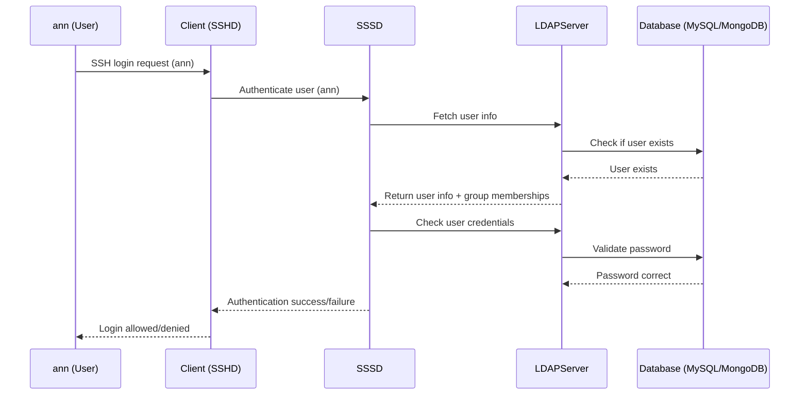
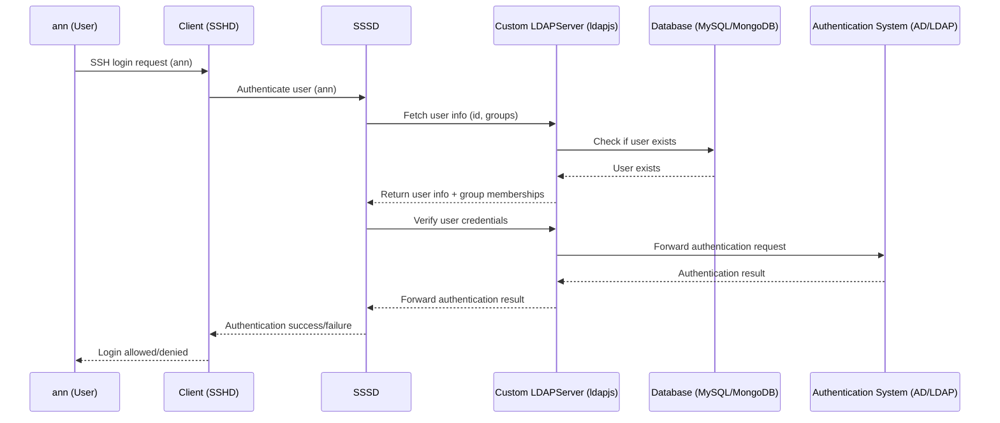
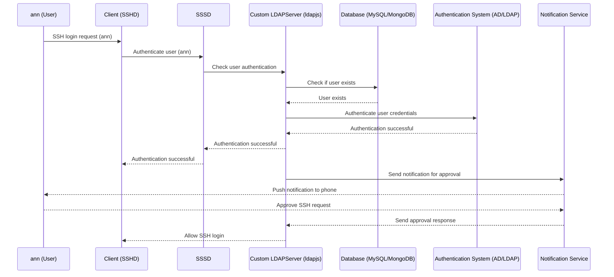

# LDAP-MySQL Authentication

This project implements an LDAP gateway server using `ldapjs` that connects to a database to manage and authenticate users. It is designed to support applications that require LDAP authentication but can store extended user information in databases(MySQL, MongoDB), making it compatible with legacy systems.



## Technologies Used

- **Node.js**: The main runtime environment for the application.
- **ldapjs**: A library for creating and managing LDAP servers in Node.js.
- **MySQL**: A relational database used to store extended user details.
- **dotenv**: Manages environment variables securely.
- **Docker**: For containerizing the MySQL and LDAP services.

## Getting Started

### Prerequisites

Ensure you have the following installed:

- [Docker](https://www.docker.com/): For setting up the LDAP server and MySQL in containers.
- [Node.js](https://nodejs.org/): JavaScript runtime for running the Node.js server.

### Installation

1. **Clone the Repository**:

   ```bash
   git clone https://github.com/anishapant21/LDAP-SQL-Auth.git
   cd LDAP-SQL-Auth
   ```

### Environment Variables Setup

The required environment variables are listed in `.env.example`. You need to create a `.env` file and populate it with your own values.

```sh
cp .env.example .env
```

Then, edit the `.env` file with appropriate values:

- `MYSQL_HOST`, `MYSQL_USER`, `MYSQL_PASSWORD`, `MYSQL_DATABASE`: MySQL connection details.
- `LDAP_BASE_DN`: Base DN for the LDAP directory.
- `LDAP_PORT`: The port on which the LDAP server listens (default: 389).
- `NOTIFICATION_URL`: Base URL for the server handling notification to the authenticator app.
- `LDAP_CERT_CONTENT`, `LDAP_KEY_CONTENT` : TLS certificates.

### Usage

#### Starting the Server and Containers

To start both the Docker containers (MySQL and LDAP client) and the Node.js server locally, use the provided `launch.sh` script.

1. Ensure the `launch.sh` script is executable. You can make it executable using the following command:

   ```bash
   chmod +x launch.sh
   ```

2. Run the `launch.sh` script:

   ```bash
   ./launch.sh
   ```

   This script will:

   - Start the Docker containers (`mysql` and `ldap_client`) using Docker Compose.
   - Install the Node.js dependencies.
   - Start the Node.js server locally.

#### Access the Client Bash

To interact with the LDAP client container, enter it using:

```bash
docker exec -it ldap_client /bin/bash
```

#### Perform an LDAP Search

Query the LDAP server using the `ldapsearch` command:

```bash
ldapsearch -x -H ldap://host.docker.internal:389 -b "dc=mieweb,dc=com" "(uid=ann)"
```

```bash
ldapsearch -x -H ldaps://host.docker.internal:636 -b "dc=mieweb,dc=com" "(uid=ann)"
```

#### Authentication

To authenticate via SSH using the LDAP credentials, run:

```bash
ssh ann@localhost -p 2222
```

### Stopping the Server

To stop the LDAP server and associated containers, run:

```bash
./shutdown.sh
```

This will stop and clean up Docker containers, networks, and the Node.js server.

## Project Structure

```plaintext
/LDAP
├── docker/
│   ├── client/
│   │   ├── Dockerfile         # Dockerfile for the Linux client setup
│   │   ├── sssd.conf          # SSSD configuration for client
│   ├── sql/
│   │   └── init.sql           # MySQL initialization script for user data
│   ├── docker-compose.yml     # Docker Compose configuration
├── launch.sh                  # Shell script to start Docker containers and Node.js server
├── shutdown.sh                # Shell script to stop and clean up services
├── src/
│   ├── server.js              # Main Node.js application (LDAP server)
│   ├── package.json           # Dependencies for Node.js
│   ├── package-lock.json      # Lock file for Node.js dependencies
│   └── .env.example           # Environment variables configuration file
└── README.md                  # Documentation (this file)
```

## Elaborative

### With AD/LDAP for authentication



### Integration with Push notification

