# LDAP Gateway

A modular LDAP gateway server that bridges LDAP authentication to various backends (MySQL/MongoDB/Proxmox). Built with Node.js and ldapjs, it separates **directory lookups** (user/group info) from **authentication** (password validation) for flexible integration with modern and legacy systems.

## 🏗️ Architecture

The project is structured as a **modular monorepo** with distinct responsibilities:


### � Authentication Flow

```mermaid
sequenceDiagram
    participant User as 👤 User
    participant Client as 🖥️ SSH Client
    participant SSSD as 🔐 SSSD
    participant Gateway as 🌉 LDAP Gateway
    participant Directory as 📁 Directory Backend
    participant Auth as 🔑 Auth Backend
    
    User->>Client: SSH login attempt
    Client->>SSSD: Authenticate user
    SSSD->>Gateway: LDAP bind request
    Gateway->>Directory: Fetch user info
    Directory-->>Gateway: User details + groups
    Gateway->>Auth: Validate credentials
    Auth-->>Gateway: Auth result
    Gateway-->>SSSD: LDAP response
    SSSD-->>Client: Access granted/denied
    Client-->>User: Login success/failure
```



---

## 🚀 Quick Start

### Installation Options

#### Option 1: Binary Release (Recommended)
```bash
# Download latest release
curl -LO https://github.com/mieweb/LDAPServer/releases/latest/download/ldap-gateway-linux.tar.gz
tar -xzf ldap-gateway-linux.tar.gz
cd ldap-gateway-*
sudo ./install.sh
```

#### Option 2: Package Manager

**Ubuntu/Debian:**
```bash
curl -LO https://github.com/mieweb/LDAPServer/releases/latest/download/ldap-gateway_amd64.deb
sudo dpkg -i ldap-gateway_amd64.deb
```

**RHEL/CentOS/Fedora:**
```bash
curl -LO https://github.com/mieweb/LDAPServer/releases/latest/download/ldap-gateway.rpm
sudo rpm -i ldap-gateway.rpm
```

**macOS (Homebrew):**
```bash
brew tap mieweb/homebrew-tap
brew install ldap-gateway
```

#### Option 3: Development Setup
```bash
git clone https://github.com/mieweb/LDAPServer.git
cd LDAPServer
npm install
cp server/.env.example server/.env
# Edit .env with your configuration
./launch.sh
```

### Configuration

Create or edit `/etc/ldap-gateway/.env`:

```ini
# Directory backend: where to find user/group information
DIRECTORY_BACKEND=mysql  # mysql | mongodb | proxmox

# Authentication backend: how to validate passwords  
AUTH_BACKEND=ldap       # db | ldap | proxmox

# MySQL (WebChart integration)
MYSQL_HOST=localhost
MYSQL_PORT=3306
MYSQL_USER=ldap_user
MYSQL_PASSWORD=secure_password
MYSQL_DATABASE=webchart

# External LDAP/AD authentication
LDAP_BIND_DN=CN=ldap-service,OU=Service Accounts,DC=company,DC=com
LDAP_BIND_PASSWORD=ldap_service_password
AD_DOMAIN=company.com

# Server settings
LDAP_PORT=636
LDAP_BASE_DN=dc=company,dc=com
```

### Start Service

```bash
# Using systemd (installed packages)
sudo systemctl enable ldap-gateway
sudo systemctl start ldap-gateway

# Or run directly  
ldap-gateway

# Development mode
npm run dev
```

---

## 🔧 Backend Configuration

The LDAP gateway separates **directory lookups** from **authentication**, allowing flexible mixing:

### Directory Backends (`DIRECTORY_BACKEND`)

| Backend | Description | Use Case |
|---------|-------------|----------|
| `mysql` | MySQL/MariaDB with WebChart schema | Healthcare systems, EHR integration |
| `mongodb` | MongoDB collections | Modern web applications |
| `proxmox` | Proxmox user.cfg/shadow.cfg files | Virtualization environments |

### Authentication Backends (`AUTH_BACKEND`) 

| Backend | Description | Use Case |
|---------|-------------|----------|
| `db` | Database password hashes | Self-contained authentication |
| `ldap` | External LDAP/Active Directory | Enterprise SSO integration |
| `proxmox` | Proxmox shadow file | Proxmox container authentication |

### Example Configurations

#### WebChart + Active Directory
```ini
DIRECTORY_BACKEND=mysql    # User info from WebChart
AUTH_BACKEND=ldap         # Passwords via AD
MYSQL_HOST=webchart-db
AD_DOMAIN=hospital.local
```

#### MongoDB Self-Contained
```ini  
DIRECTORY_BACKEND=mongodb  # User info from MongoDB
AUTH_BACKEND=db           # Passwords in MongoDB
MONGODB_URI=mongodb://localhost:27017/users
```

#### Proxmox Container Auth
```ini
DIRECTORY_BACKEND=proxmox  # Users from Proxmox config
AUTH_BACKEND=proxmox      # Passwords from Proxmox
PROXMOX_USER_CFG=/etc/pve/user.cfg
PROXMOX_SHADOW_CFG=/etc/pve/shadow.cfg
```

---

## 🧪 Testing

### LDAP Queries
```bash
# Search for users
ldapsearch -x -H ldaps://localhost:636 -b "dc=company,dc=com" "(uid=john)"

# List all users  
ldapsearch -x -H ldaps://localhost:636 -b "dc=company,dc=com" "(objectClass=posixAccount)"

# List groups
ldapsearch -x -H ldaps://localhost:636 -b "dc=company,dc=com" "(objectClass=posixGroup)"
```

### SSH Authentication
```bash
# Test SSH authentication through SSSD
ssh john@ldap-client-host

# Test with specific port
ssh john@localhost -p 2222
```

### Health Check
```bash
# Check service status
systemctl status ldap-gateway

# View logs
journalctl -u ldap-gateway -f

# Test configuration
ldap-gateway --config-test
```

---

## 🏥 WebChart Integration

Specialized support for [WebChart EHR](https://www.mieweb.com/) systems:

### Schema Mapping
- **Users** → `posixAccount` objects with healthcare-specific attributes
- **UID Numbers** → Derived from "LDAP UID Number" observations or `user_id + 10000`
- **Groups** → Based on WebChart realms and roles
- **Security** → Integrates with WebChart permission system

### Configuration
```ini
DIRECTORY_BACKEND=mysql
MYSQL_DATABASE=webchart
MYSQL_USER=readonly_user

# Optional: Custom observation code for UID mapping
LDAP_UID_OBS_NAME="Custom UID Field"
```

---

## 🖥️ Proxmox Integration  

Direct integration with Proxmox virtualization environments:

### Features
- **Container Authentication** → Centralized LDAP for all containers/VMs
- **Configuration Syncing** → Reads directly from Proxmox user/shadow files
- **MFA Support** → Optional push notifications via [MIE Authenticator](https://github.com/mieweb/mieweb_auth_app)
- **Automated Setup** → Use [pown.sh](https://github.com/anishapant21/pown.sh) for container LDAP client configuration

### Deployment
```bash
# Install in Proxmox container
pct create 100 --template debian-12 --hostname ldap-gateway
pct set 100 --mp0 /etc/pve,mp=/etc/pve:ro  # Mount Proxmox config
pct start 100
pct enter 100

# Install LDAP Gateway
curl -L https://github.com/mieweb/LDAPServer/releases/latest/download/ldap-gateway_amd64.deb
dpkg -i ldap-gateway_amd64.deb

# Configure for Proxmox
cat > /etc/ldap-gateway/.env << EOF
DIRECTORY_BACKEND=proxmox
AUTH_BACKEND=proxmox
PROXMOX_USER_CFG=/etc/pve/user.cfg
PROXMOX_SHADOW_CFG=/etc/pve/shadow.cfg
EOF

systemctl enable --now ldap-gateway
```

---

## 📦 Development

### Architecture Overview
```
LDAPServer/
├── npm/                    # @ldap-gateway/core package
│   ├── src/               # Core interfaces and utilities  
│   ├── dist/              # Built package
│   └── package.json       # Core package definition
├── server/                # ldap-gateway-server package
│   ├── src/               # Server implementation
│   ├── dist/              # Built server
│   └── package.json       # Server package definition
├── .github/workflows/     # CI/CD automation
├── nfpm/                  # Package configuration
├── docker/                # Development containers
└── terraform/             # AWS deployment
```

### Building

```bash
# Install dependencies
npm install

# Build core package
npm run build:core

# Build server package  
npm run build:server

# Create binary
npm run build:binary

# Build packages (.deb/.rpm)
nfpm package --packager deb
```

### Testing

```bash  
# Run all tests
npm test

# Test specific package
npm run test:core
npm run test:server

# Integration testing with Docker
./launch.sh  # Starts MySQL + test client
./shutdown.sh  # Cleanup
```

### Contributing

1. **Fork** and **clone** the repository
2. **Create** a feature branch: `git checkout -b feature/my-feature`
3. **Make** your changes with tests
4. **Run** the test suite: `npm test`
5. **Submit** a pull request

---

## 📚 Resources

- 🎥 **[Demo Video](https://youtu.be/qsE1BWpmsME?si=MRnwFHu6LCd-2fhk)** - Complete setup walkthrough
- 📖 **[API Documentation](./npm/README.md)** - Core package usage
- 🔧 **[Server Configuration](./server/README.md)** - Server setup guide
- 🏥 **[WebChart Integration](https://docs.google.com/document/d/1_6iutppKego9Kg_FGuDg5OwbXJUqZ0a2Fj7ajgNLU8k/edit)** - Healthcare deployment
- 📱 **[MIE Authenticator](https://github.com/mieweb/mieweb_auth_app)** - MFA mobile app
- 🛠️ **[pown.sh](https://github.com/anishapant21/pown.sh)** - Container automation

---

## 📄 License

MIT License - see [LICENSE](LICENSE) file for details.

---

<sub>Built with ❤️ by [MIEWeb](https://www.mieweb.com/) for healthcare and enterprise environments.</sub>

Edit `.env` with appropriate values (see [Configuration](#-configuration)).

---

### Usage

Start everything locally:

```bash
./launch.sh
```

This will:

* Spin up MySQL + LDAP client in Docker
* Start LDAP server

To stop:

```bash
./shutdown.sh
```

---

### Testing

LDAP search:

```bash
ldapsearch -x -H ldaps://localhost:636 -b "dc=mieweb,dc=com" "(uid=ann)"
ldapsearch -x -H ldaps://localhost:636 -b "dc=mieweb,dc=com" "(objectClass=posixAccount)"
```

SSH authentication:

```bash
ssh ann@localhost -p 2222
```

---

## 🔑 Backends

The LDAP server separates **authentication** from **directory lookups**.

### Directory Backends (`DIRECTORY_BACKEND`)

* **`mysql`** -> MySQL as directory source
* **`mongodb`** → MongoDB as directory source.
* **`proxmox`** → users discovered through Proxmox configuration files

### Authentication Backends (`AUTH_BACKEND`)

* **`db`** → Passwords validated against DB.
* **`ldap`** → Passwords validated against external AD/LDAP.
* **`proxmox`** → Passwords validated against proxmox config files.


---

## 📖 WebChart Integration

The LDAP server includes a dedicated integration with the WebChart MySQL schema, allowing users managed in WebChart to be exposed through LDAP in a standards-compliant way.

### Schema Mapping

* **User Mapping** → WebChart users are mapped into LDAP `posixAccount` objects.
* **UID Number (`uidNumber`)** →

  * Primary source: The value is derived from the WebChart **Observation Code** named *“LDAP UID Number”*.
  * If multiple observation entries exist, the **latest value** is always selected.
  * Fallback: If no observation code is present, the `uidNumber` defaults to `users.user_id + 10000`.
* **GID Number (`gidNumber`)** → Derived from the `realms.id` field in WebChart.

---

## 🔧 Configuration

Example `.env` for WebChart + AD auth:

```ini
# Directory backend: db (WebChart SQL)
DIRECTORY_BACKEND=db

# Authentication backend: db or ldap
AUTH_BACKEND=ldap

# MySQL (WebChart)
MYSQL_HOST=
MYSQL_PORT=
MYSQL_USER=
MYSQL_PASSWORD=
MYSQL_DATABASE=

# AD / LDAP auth
AD_DOMAIN=
LDAP_BIND_DN=
LDAP_BIND_PASSWORD=

# Optional: Observation Code override
LDAP_UID_OBS_NAME=
```

---

## Proxmox Integration

In addition to database backends (WebChart/MySQL, MongoDB), the LDAP server also integrates directly with **Proxmox environments**. This enables centralized authentication for containers and VMs while leveraging existing Proxmox user and group configuration.

### Features

* **Direct File Access** → Reads from `user.cfg` and `shadow.cfg` to reflect Proxmox users into LDAP.
* **Auto-Reload** → Automatically detects changes to config files and reloads user/group data without restart.
* **Containerized Deployment** → LDAP server runs as a container inside Proxmox.
* **Centralized Authentication** → Single LDAP authority for all Proxmox containers.
* **MFA Support** → Optional multi-factor authentication through the [MIE Authenticator App](https://github.com/mieweb/mieweb_auth_app).
* **Automation** → The [`pown.sh`](https://github.com/anishapant21/pown.sh) script configures LDAP clients on containers automatically (packages, services, sudo setup).

### Configuration

To enable Proxmox integration, configure the following in your `.env`:

```sh
# Proxmox Integration
DIRECTORY_BACKEND=proxmox
AUTH_BACKEND=proxmox
PROXMOX_USER_CFG=<path-to-user.cfg>
PROXMOX_SHADOW_CFG=<path-to-shadow.cfg>
```

### Authentication Flow

1. User connects via SSH to a container.
2. The container forwards authentication to the LDAP server.
3. The LDAP server validates the credentials against Proxmox config.
4. If MFA is enabled, a push notification is sent to the user’s device.
5. On approval, access is granted.

### Resources

* [LDAPServer](https://github.com/mieweb/LDAPServer)
* [pown.sh](https://github.com/anishapant21/pown.sh) – Automated Proxmox LDAP client setup
* [MIE Auth App](https://github.com/mieweb/mieweb_auth_app) – MFA mobile application
* [Full Proxmox Integration Documentation](https://docs.google.com/document/d/1_6iutppKego9Kg_FGuDg5OwbXJUqZ0a2Fj7ajgNLU8k/edit?usp=sharing)

---

## Elaborative

### With AD/LDAP for authentication


### Integration with Push notification


## 📺 Demo

🎥 [LDAP Server Demo](https://youtu.be/qsE1BWpmsME?si=MRnwFHu6LCd-2fhk)
